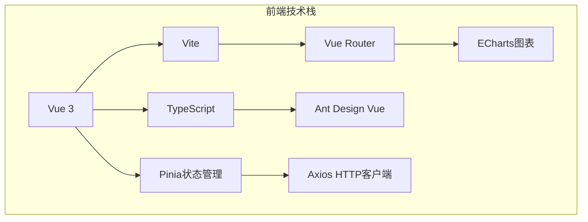
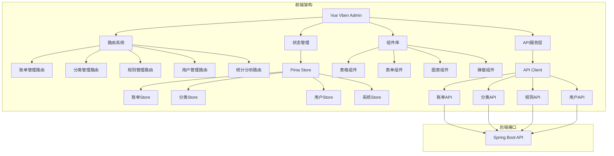
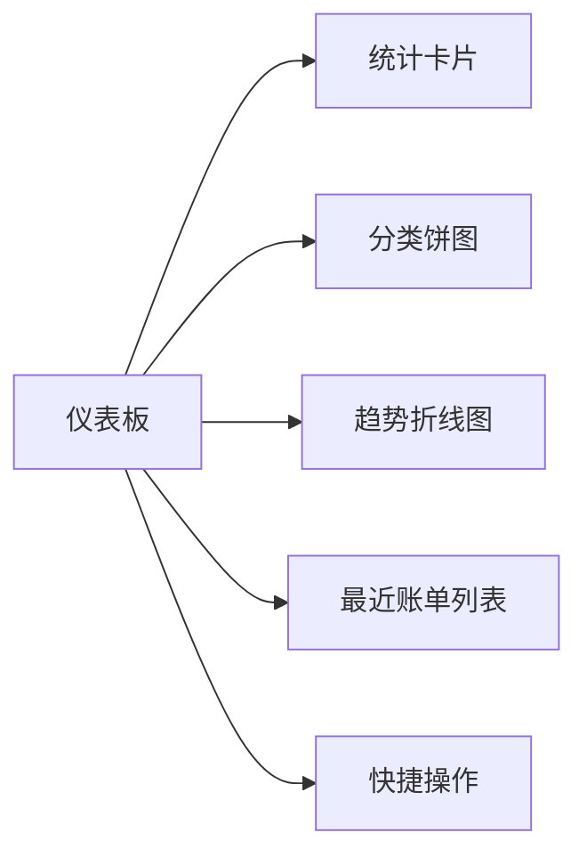
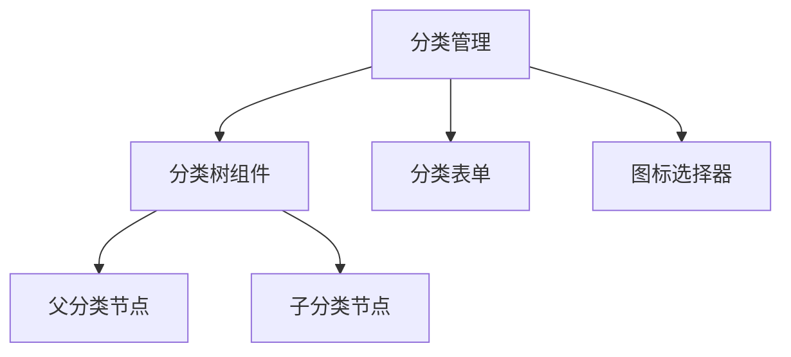
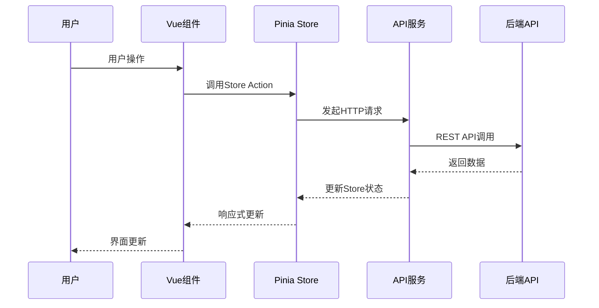

# log4M 前端管理后台集成设计

## 概述

本设计文档旨在为log4M个人记账系统集成基于Vue Vben Admin的前端管理后台模块。log4M是一个基于Telegram Bot的记账系统，主要通过Telegram接口提供记账服务。为了提供更完善的管理功能和数据分析能力，我们将集成一个Web端的管理后台。

**项目目标**：
- 提供Web端的账单、分类、规则等数据管理界面
- 实现数据统计和可视化分析功能
- 提供用户管理和系统配置功能
- 保持与现有Telegram Bot功能的完整兼容

## 技术栈与依赖

### 前端技术栈


**核心框架**：
- Vue 3：前端主框架
- Vite：构建工具
- TypeScript：类型安全
- Vue Router：路由管理
- Pinia：状态管理

**UI组件库**：
- Ant Design Vue：UI组件库
- Iconify：图标库
- ECharts：数据可视化

**工具库**：
- Axios：HTTP请求
- Day.js：日期处理
- Lodash：工具函数

### 后端扩展要求
- Spring Boot 3.4.4（现有）
- 新增Cross-Origin支持
- 完善REST API接口
- JWT认证机制（可选）

## 前端架构设计

### 整体架构图


### 目录结构设计
```
frontend-admin/
├── src/
│   ├── api/                    # API接口定义
│   │   ├── bill.ts            # 账单API
│   │   ├── category.ts        # 分类API
│   │   ├── rule.ts           # 规则API
│   │   ├── user.ts           # 用户API
│   │   └── account.ts        # 账户API
│   ├── components/            # 公共组件
│   │   ├── Charts/           # 图表组件
│   │   ├── Tables/           # 表格组件
│   │   └── Forms/            # 表单组件
│   ├── stores/               # Pinia状态管理
│   │   ├── bill.ts          # 账单状态
│   │   ├── category.ts      # 分类状态
│   │   ├── rule.ts          # 规则状态
│   │   └── user.ts          # 用户状态
│   ├── views/                # 页面组件
│   │   ├── dashboard/        # 仪表板
│   │   ├── bill/            # 账单管理
│   │   ├── category/        # 分类管理
│   │   ├── rule/            # 规则管理
│   │   ├── account/         # 账户管理
│   │   └── user/            # 用户管理
│   ├── router/              # 路由配置
│   ├── utils/               # 工具函数
│   └── types/               # TypeScript类型定义
├── public/
└── package.json
```

## 功能模块设计

### 1. 仪表板模块
**页面路径**：`/dashboard`

**功能特性**：
- 今日/本月账单统计
- 支出分类饼图
- 近期账单趋势图
- 快捷操作面板

**组件构成**：


### 2. 账单管理模块
**页面路径**：`/bill`

**功能特性**：
- 账单列表查询（支持分页、筛选、排序）
- 账单新增/编辑/删除
- 批量操作功能
- 账单导入/导出

**数据模型**：
```typescript
interface Bill {
  billId: number;
  billDate: string;
  amount: number;
  description: string;
  categoryId: number;
  categoryName: string;
  accountId: number;
  accountName: string;
  tagId?: number;
  tagName?: string;
  transactionType: 'INCOME' | 'EXPENSE';
  crTime: string;
  upTime: string;
}
```

### 3. 分类管理模块
**页面路径**：`/category`

**功能特性**：
- 树形分类结构展示
- 分类新增/编辑/删除
- 分类层级管理
- 分类图标设置

**组件结构**：


### 4. 规则管理模块
**页面路径**：`/rule`

**功能特性**：
- 记账规则列表管理
- 规则新增/编辑/删除
- 关键词匹配测试
- 规则优先级设置

**数据模型**：
```typescript
interface Rule {
  ruleId: number;
  ruleName: string;
  keywords: string;
  categoryId: number;
  amount: number;
  transactionType: 'INCOME' | 'EXPENSE';
  priority: number;
  isActive: boolean;
  crTime: string;
  upTime: string;
}
```

### 5. 账户管理模块
**页面路径**：`/account`

**功能特性**：
- 账户列表管理
- 账户余额统计
- 预算设置管理
- 默认账户设置

### 6. 用户管理模块
**页面路径**：`/user`

**功能特性**：
- Telegram用户信息管理
- 用户账单统计
- 用户权限管理（预留）

## API接口设计

### REST API规范
基于现有Spring Boot后端扩展REST API接口，遵循RESTful设计原则。

### 接口清单

#### 账单接口
```typescript
// 分页查询账单
GET /api/bills?page=1&size=20&categoryId=1&startDate=2023-01-01&endDate=2023-12-31

// 创建账单
POST /api/bills
{
  "billDate": "2023-12-01",
  "amount": 50.00,
  "description": "午餐",
  "categoryId": 1,
  "accountId": 1,
  "transactionType": "EXPENSE"
}

// 更新账单
PUT /api/bills/{id}

// 删除账单
DELETE /api/bills/{id}

// 批量删除
DELETE /api/bills/batch
{
  "ids": [1, 2, 3]
}

// 统计接口
GET /api/bills/statistics/daily?date=2023-12-01
GET /api/bills/statistics/monthly?month=2023-12
GET /api/bills/statistics/category?startDate=2023-01-01&endDate=2023-12-31
```

#### 分类接口
```typescript
// 获取分类树
GET /api/categories/tree

// 创建分类
POST /api/categories
{
  "categoryName": "餐饮",
  "parentCategoryId": null,
  "categoryType": "EXPENSE",
  "icon": "icon-food"
}

// 更新分类
PUT /api/categories/{id}

// 删除分类
DELETE /api/categories/{id}
```

#### 规则接口
```typescript
// 查询规则列表
GET /api/rules?page=1&size=20

// 创建规则
POST /api/rules
{
  "ruleName": "午餐规则",
  "keywords": "午餐,吃饭",
  "categoryId": 1,
  "amount": 30.00,
  "transactionType": "EXPENSE"
}

// 测试规则匹配
POST /api/rules/test
{
  "text": "今天午餐花了25元"
}
```

## 状态管理设计

### Pinia Store结构
```typescript
// stores/bill.ts
export const useBillStore = defineStore('bill', {
  state: () => ({
    bills: [] as Bill[],
    currentBill: null as Bill | null,
    loading: false,
    pagination: {
      current: 1,
      pageSize: 20,
      total: 0
    },
    filters: {
      categoryId: null,
      startDate: null,
      endDate: null,
      transactionType: null
    }
  }),
  
  actions: {
    async fetchBills() {},
    async createBill(bill: CreateBillDto) {},
    async updateBill(id: number, bill: UpdateBillDto) {},
    async deleteBill(id: number) {},
    async fetchStatistics() {}
  }
});

// stores/category.ts
export const useCategoryStore = defineStore('category', {
  state: () => ({
    categories: [] as Category[],
    categoryTree: [] as CategoryTreeNode[],
    loading: false
  }),
  
  actions: {
    async fetchCategories() {},
    async fetchCategoryTree() {},
    async createCategory(category: CreateCategoryDto) {},
    async updateCategory(id: number, category: UpdateCategoryDto) {},
    async deleteCategory(id: number) {}
  }
});
```

## 路由配置

### 路由表设计
```typescript
export const routes = [
  {
    path: '/dashboard',
    name: 'Dashboard',
    component: () => import('@/views/dashboard/index.vue'),
    meta: {
      title: '仪表板',
      icon: 'dashboard'
    }
  },
  {
    path: '/bill',
    name: 'BillManagement',
    children: [
      {
        path: 'list',
        name: 'BillList',
        component: () => import('@/views/bill/list.vue'),
        meta: { title: '账单列表' }
      },
      {
        path: 'create',
        name: 'BillCreate',
        component: () => import('@/views/bill/form.vue'),
        meta: { title: '新增账单' }
      }
    ]
  },
  {
    path: '/category',
    name: 'CategoryManagement',
    component: () => import('@/views/category/index.vue'),
    meta: {
      title: '分类管理',
      icon: 'category'
    }
  },
  {
    path: '/rule',
    name: 'RuleManagement',
    component: () => import('@/views/rule/index.vue'),
    meta: {
      title: '规则管理',
      icon: 'rule'
    }
  }
];
```

## 组件设计

### 核心公共组件

#### 1. 数据表格组件
```vue
<template>
  <div class="data-table">
    <a-table
      :columns="columns"
      :data-source="dataSource"
      :pagination="pagination"
      :loading="loading"
      @change="handleTableChange"
    >
      <template #bodyCell="{ column, record }">
        <slot
          :name="column.dataIndex"
          :record="record"
          :value="record[column.dataIndex]"
        />
      </template>
    </a-table>
  </div>
</template>
```

#### 2. 表单组件
```vue
<template>
  <a-form
    :model="form"
    :rules="rules"
    @finish="handleSubmit"
  >
    <slot :form="form" />
    <a-form-item>
      <a-button type="primary" html-type="submit" :loading="loading">
        {{ submitText }}
      </a-button>
      <a-button @click="handleCancel" style="margin-left: 8px">
        取消
      </a-button>
    </a-form-item>
  </a-form>
</template>
```

#### 3. 统计图表组件
```vue
<template>
  <div class="chart-container">
    <div ref="chartRef" :style="{ width: '100%', height }"></div>
  </div>
</template>

<script setup lang="ts">
import * as echarts from 'echarts';

interface Props {
  option: echarts.EChartsOption;
  height?: string;
}

const props = withDefaults(defineProps<Props>(), {
  height: '400px'
});
</script>
```

## 样式与主题

### 主题配置
```typescript
// 主题变量
export const themeConfig = {
  colorPrimary: '#1890ff',
  colorSuccess: '#52c41a',
  colorWarning: '#faad14',
  colorError: '#f5222d',
  borderRadius: '6px',
  fontFamily: '-apple-system, BlinkMacSystemFont, "Segoe UI", Roboto'
};

// 暗色主题支持
export const darkTheme = {
  colorBgBase: '#1f1f1f',
  colorTextBase: '#fff',
  colorBorder: '#434343'
};
```

## 数据流设计

### 数据流向图


### API响应处理
```typescript
// 统一响应处理
export interface ApiResponse<T = any> {
  code: number;
  message: string;
  data: T;
}

// 统一错误处理
export const handleApiError = (error: any) => {
  if (error.response?.status === 401) {
    // 未授权处理
    router.push('/login');
  } else if (error.response?.status >= 500) {
    // 服务器错误
    message.error('服务器错误，请稍后重试');
  } else {
    // 其他错误
    message.error(error.message || '请求失败');
  }
};
```

## 后端API扩展需求

### 需要新增的Controller

#### BillController扩展
```java
@RestController
@RequestMapping("/api/bills")
@CrossOrigin(origins = "*")
public class BillController {
    
    @GetMapping
    public ResultVO<Page<Bill>> pageQuery(
        @RequestParam(defaultValue = "1") int current,
        @RequestParam(defaultValue = "20") int size,
        @RequestParam(required = false) Long categoryId,
        @RequestParam(required = false) String startDate,
        @RequestParam(required = false) String endDate,
        @RequestParam(required = false) String transactionType
    ) {
        // 实现分页查询逻辑
    }
    
    @PostMapping
    public ResultVO<Bill> create(@Valid @RequestBody CreateBillDto dto) {
        // 实现创建逻辑
    }
    
    @PutMapping("/{id}")
    public ResultVO<Boolean> update(@PathVariable Long id, @Valid @RequestBody UpdateBillDto dto) {
        // 实现更新逻辑
    }
    
    @DeleteMapping("/{id}")
    public ResultVO<Boolean> delete(@PathVariable Long id) {
        // 实现删除逻辑
    }
    
    @GetMapping("/statistics/daily")
    public ResultVO<DailyStatistics> getDailyStatistics(@RequestParam String date) {
        // 实现日统计
    }
    
    @GetMapping("/statistics/monthly")
    public ResultVO<MonthlyStatistics> getMonthlyStatistics(@RequestParam String month) {
        // 实现月统计
    }
    
    @GetMapping("/statistics/category")
    public ResultVO<List<CategoryStatistics>> getCategoryStatistics(
        @RequestParam String startDate,
        @RequestParam String endDate
    ) {
        // 实现分类统计
    }
}
```

#### 其他需要新增的Controller
- CategoryController：分类管理接口
- RuleController：规则管理接口  
- AccountController：账户管理接口
- UserController：用户管理接口
- TagController：标签管理接口
- LedgerController：账本管理接口

### CORS配置
```java
@Configuration
public class CorsConfig {
    
    @Bean
    public CorsFilter corsFilter() {
        CorsConfiguration config = new CorsConfiguration();
        config.addAllowedOriginPattern("*");
        config.addAllowedHeader("*");
        config.addAllowedMethod("*");
        config.setAllowCredentials(true);
        
        UrlBasedCorsConfigurationSource source = new UrlBasedCorsConfigurationSource();
        source.registerCorsConfiguration("/api/**", config);
        
        return new CorsFilter(source);
    }
}
```

## 构建与部署

### 开发环境设置
```bash
# 1. 克隆Vue Vben Admin模板
git clone https://github.com/vbenjs/vue-vben-admin.git frontend-admin
cd frontend-admin

# 2. 安装依赖
pnpm install

# 3. 配置环境变量
cp .env.example .env.local
# 编辑.env.local设置API地址

# 4. 启动开发服务器
pnpm dev
```

### 环境配置
```typescript
// .env.local
VITE_API_BASE_URL=http://localhost:8080/api
VITE_APP_TITLE=log4M 管理后台

// vite.config.ts
export default defineConfig({
  server: {
    port: 3000,
    proxy: {
      '/api': {
        target: 'http://localhost:8080',
        changeOrigin: true
      }
    }
  }
});
```

### 生产部署
```bash
# 构建生产版本
pnpm build

# 部署到Nginx
cp -r dist/* /var/www/html/admin/
```

### Docker化部署
```dockerfile
# Dockerfile
FROM node:18-alpine as builder
WORKDIR /app
COPY package*.json ./
RUN npm ci
COPY . .
RUN npm run build

FROM nginx:alpine
COPY --from=builder /app/dist /usr/share/nginx/html
COPY nginx.conf /etc/nginx/conf.d/default.conf
EXPOSE 80
```

## 测试策略

### 单元测试
使用Vitest进行组件和工具函数的单元测试：

```typescript
// tests/components/DataTable.test.ts
import { mount } from '@vue/test-utils';
import DataTable from '@/components/DataTable.vue';

describe('DataTable', () => {
  it('renders table with data', () => {
    const wrapper = mount(DataTable, {
      props: {
        columns: [
          { title: '名称', dataIndex: 'name' }
        ],
        dataSource: [
          { name: '测试数据' }
        ]
      }
    });
    
    expect(wrapper.find('.ant-table').exists()).toBe(true);
  });
});
```

### 集成测试
使用Playwright进行端到端测试：

```typescript
// e2e/bill-management.spec.ts
import { test, expect } from '@playwright/test';

test('should create new bill', async ({ page }) => {
  await page.goto('/bill/create');
  
  await page.fill('[data-testid="amount-input"]', '50');
  await page.fill('[data-testid="description-input"]', '午餐');
  await page.click('[data-testid="submit-button"]');
  
  await expect(page.locator('.ant-message')).toContainText('创建成功');
});
```