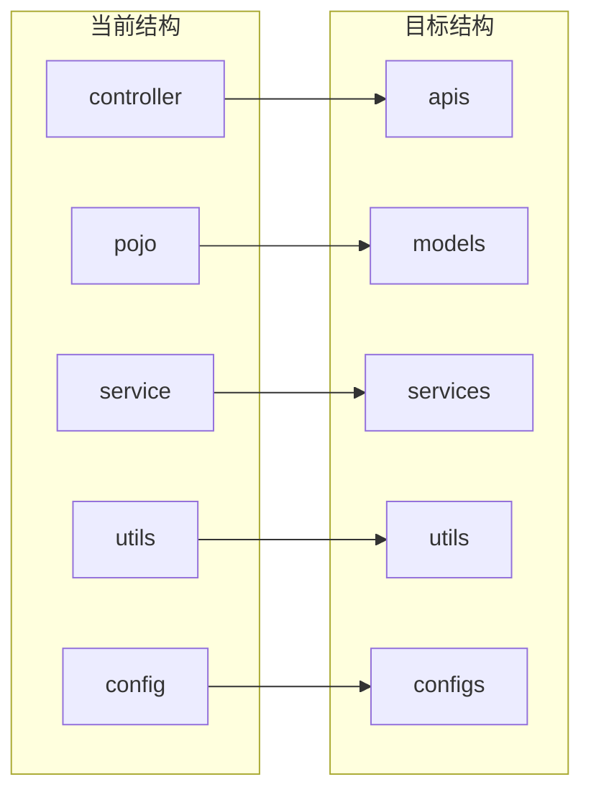
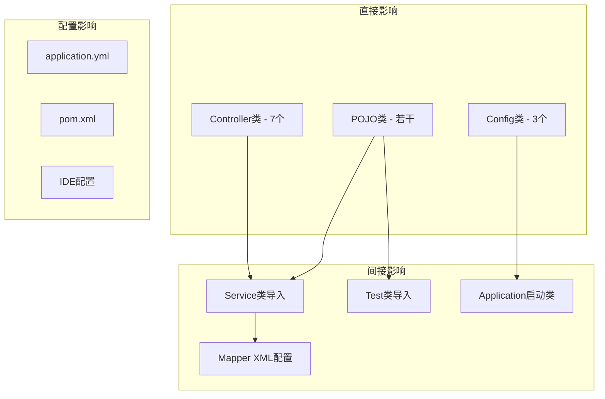

# Java后端文件夹命名统一设计

## 概述

本设计旨在统一log4M项目中Java后端与前端的文件夹命名规范，提升项目代码结构的一致性和可维护性。

## 架构分析

### 当前前端文件夹命名规范
```
frontend-admin/src/
├── api/          # API接口层
├── components/   # 组件层
├── router/       # 路由层
├── stores/       # 状态管理层
├── types/        # 类型定义层
├── utils/        # 工具层
└── views/        # 视图层
```

### 当前后端文件夹命名规范
```
src/main/java/com/tony/log4m/
├── annotation/   # 注解层
├── aop/          # 切面层
├── base/         # 基础层
├── bots/         # Bot相关层
├── config/       # 配置层
├── controller/   # 控制层
├── convert/      # 转换层
├── enums/        # 枚举层
├── exception/    # 异常层
├── external/     # 外部服务层
├── mapper/       # 数据访问层
├── pojo/         # 实体层
├── service/      # 服务层
└── utils/        # 工具层
```

## 命名规范差异分析

### 一致性对比

| 功能模块 | 前端命名 | 后端命名 | 差异说明 |
|---------|---------|---------|---------|
| API接口 | api | controller | 前端用api，后端用controller |
| 工具类 | utils | utils | ✅ 已统一 |
| 类型/实体 | types | pojo | 前端用types，后端用pojo |
| 状态管理 | stores | service | 概念相似但命名不同 |
| 路由 | router | - | 后端无对应概念 |
| 组件 | components | - | 后端无直接对应 |
| 视图 | views | - | 后端无直接对应 |

### 建议统一方案

#### 方案一：后端适配前端命名风格
- 将`controller`重命名为`apis`
- 将`pojo`重命名为`types`
- 将`service`保持不变（业务逻辑层概念明确）

#### 方案二：前端适配后端命名风格
- 将`api`重命名为`controllers`
- 将`types`重命名为`pojos`
- 将`stores`重命名为`services`

#### 方案三：混合统一方案（推荐）
基于语义清晰度和行业惯例，采用最佳实践命名：

| 层级 | 统一命名 | 说明 |
|-----|---------|------|
| API接口层 | `apis` | 统一为apis，语义更明确 |
| 实体/类型层 | `models` | 使用通用的models概念 |
| 业务逻辑层 | `services` | 保持services，前后端统一 |
| 工具层 | `utils` | 已统一，无需修改 |
| 配置层 | `configs` | 后端保持config，前端可增加 |

## 文件夹重构映射表

### 后端重构映射



### 详细重构计划

#### 1. controller → apis
- **影响范围**: 7个Controller类
- **重构内容**:
  - 目录重命名: `controller/` → `apis/`
  - 包名更新: `com.tony.log4m.controller` → `com.tony.log4m.apis`
  - 导入语句更新: 所有引用该包的import语句

#### 2. pojo → models
- **影响范围**: dto、entity、vo子包
- **重构内容**:
  - 目录重命名: `pojo/` → `models/`
  - 包名更新: `com.tony.log4m.pojo` → `com.tony.log4m.models`
  - 子包结构保持不变: `dto/`, `entity/`, `vo/`

#### 3. config → configs
- **影响范围**: 3个配置类
- **重构内容**:
  - 目录重命名: `config/` → `configs/`
  - 包名更新: `com.tony.log4m.config` → `com.tony.log4m.configs`

## 重构步骤与风险评估

### 重构执行步骤

1. **准备阶段**
   - 备份当前代码
   - 停止应用服务
   - 确认测试覆盖率

2. **文件夹重命名**
   - 使用IDE的重构功能批量重命名包
   - 更新包声明和导入语句

3. **配置文件更新**
   - 更新MyBatis Mapper XML中的namespace
   - 更新Spring Boot自动扫描包路径
   - 更新单元测试中的包引用

4. **验证阶段**
   - 编译验证
   - 单元测试验证
   - 集成测试验证

### 风险评估与缓解策略

| 风险类型 | 风险描述 | 缓解策略 |
|---------|---------|---------|
| 编译错误 | 包引用路径错误 | 使用IDE重构工具，自动更新引用 |
| 运行时错误 | Spring扫描路径问题 | 更新@ComponentScan注解配置 |
| 测试失败 | 测试类包路径错误 | 批量更新测试类import语句 |
| 部署问题 | 配置文件路径错误 | 检查并更新相关配置文件 |

## 重构影响范围分析

### 代码文件影响



### Maven构建配置

确保pom.xml中的资源路径和编译配置无需修改：
```xml
<build>
    <resources>
        <resource>
            <directory>src/main/resources</directory>
        </resource>
    </resources>
</build>
```

### Spring Boot扫描配置

更新主应用类的包扫描路径：
```java
@SpringBootApplication
@ComponentScan(basePackages = "com.tony.log4m")
public class Log4MApplication {
    // 保持现有扫描范围，自动适配新包名
}
```

## 前端命名统一建议

为保持前后端完全一致，建议前端也进行相应调整：

### 前端重构建议

| 当前目录 | 建议目录 | 说明 |
|---------|---------|------|
| api | apis | 与后端保持一致 |
| types | models | 统一实体概念 |
| stores | services | 统一业务逻辑概念 |

### 前端重构示例

```typescript
// 修改前
import { getUserList } from '@/api/user'
import type { User } from '@/types/index'

// 修改后  
import { getUserList } from '@/apis/user'
import type { User } from '@/models/index'
```

## 实施建议

### 优先级评估

1. **高优先级**: controller → apis（影响API接口规范）
2. **中优先级**: pojo → models（影响数据模型一致性）
3. **低优先级**: config → configs（影响相对较小）

### 分阶段实施

**阶段一**: 重构核心业务包
- 完成controller → apis重构
- 验证API接口正常运行

**阶段二**: 重构数据模型包
- 完成pojo → models重构
- 验证数据访问层正常

**阶段三**: 重构配置包
- 完成config → configs重构
- 全面验证系统功能

## 验证清单

### 编译验证
- [ ] Maven编译无错误
- [ ] IDE无包引用错误
- [ ] 静态代码检查通过

### 功能验证
- [ ] Spring Boot应用正常启动
- [ ] Telegram Bot功能正常
- [ ] REST API接口正常响应
- [ ] 数据库操作正常

### 测试验证
- [ ] 单元测试全部通过
- [ ] 集成测试正常执行
- [ ] API测试覆盖完整

通过本次重构，项目的文件夹命名将更加规范统一，有利于团队协作和代码维护。